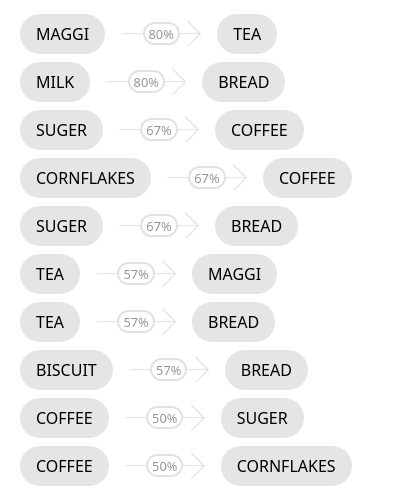
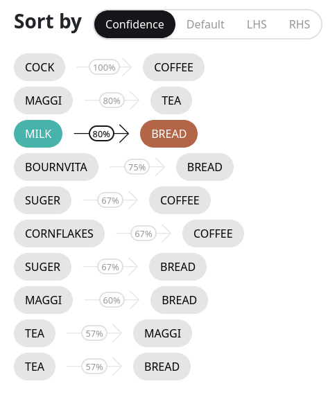
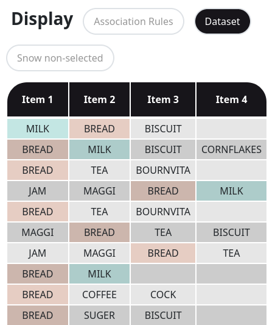

# Mining Association Rules

Association rules are mined in transactional datasets. Such datasets consist of records resembling supermarket receipts; these records are called transactions. Essentially, a transaction is a list of items. This primitive discovers rules that can be described as follows: “if a transaction contains item A, then it may also contain item B with some probability”. Therefore, we get rules that look like A->B, where A is called RHS (Right Hand Side) and B is called LHS (Left Hand Side). Note that A and B can contain either a single item or many items. Algorithms for mining association rules rely on two parameters: _support_ and _confidence_. _Support_ reflects the number of transactions where considered rule holds, while _confidence_ reflects conditional probability of a transaction to contain B, given that transaction contains A.

## Configuring the task
At the beginning you have to select an algorithm for association rule mining. For now our tool supports only the Apriori algorithm. In the future we plan to extend the number of available algorithms.

### Input format
After selecting an algorithm you have to upload the file with a dataset or select one of the built-in.

Desbordante accepts CSV files which may come in two formats: _singular_ and _tabular_. They share two parameters – _Delimiter_ which sets a symbol that is used as a delimiter when a CSV file will be parsed, and _Has header row_ which indicates whether the first line of a dataset contains column names.

The singular format describes a table that has only two columns. The first one – the _ID column_ – should contain an integer which is basically the unique id of a transaction. The second one – the _Itemset column_ – should be a string, containing the item which belongs to the transaction with the corresponding id. For uploaded datasets it is possible to manually specify both of them, which is useful if the table contains extra columns.

The tabular format also describes a table. However, in this case each transaction is represented by a single table row. The first column of this table may contain transaction id, the boolean parameter _Has transaction ID_ indicates whether it is present. The rest of the columns contain names of items belonging to the corresponding transaction.

### Algorithm parameters
Algorithms for association rule mining take two parameters as input: minimum support and minimum confidence. Algorithm search for all rules that:
* the share of transactions where rule holds (support), is greater or equal than _minimum support_
* Rule confidence is greater or equal than _minimum confidence_

### Running the task
Click “Analyze” to launch the task. This button immediately becomes available after selecting a dataset.

### Analyzing the results
An example output of the algorithm is presented below. It is a list of discovered association rules conforming to the specified parameters. Each rule has its confidence shown inside the arrow.

Since the list of rules may be fairly large, we have provided an opportunity to sort it using various parameters, for example, by confidence in descending order. Desbordante also supports regular expressions for filtering.

It is possible to select one of the found rules and switch to the Dataset tab. In this tab Desbordante displays the source dataset in the Tabular format, where items belonging to the rule are highlighted by various colors. The _Show non-selected_ parameter determines whether to show transactions (rows) which are not affected by the selected rule.

## Additional information
For detailed explanation of the association rule concept see:

[1] Aggarwal Charu C. Data Mining: The Textbook. –– Springer Publishing Company, Incorporated, 2015. –– ISBN: 3319141414.

[2] Agrawal Rakesh and Srikant Ramakrishnan. Fast Algorithms for Mining Association Rules // Proc. 20th Int. Conf. Very Large Data Bases VLDB. –– 2000. –– 08. –– Vol. 1215.

[Back to the main page](../index.md)
