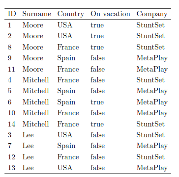
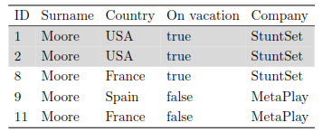
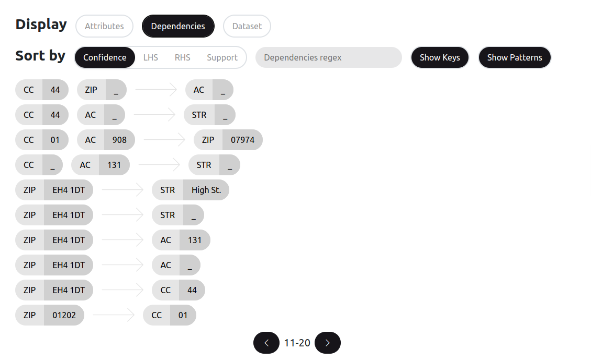
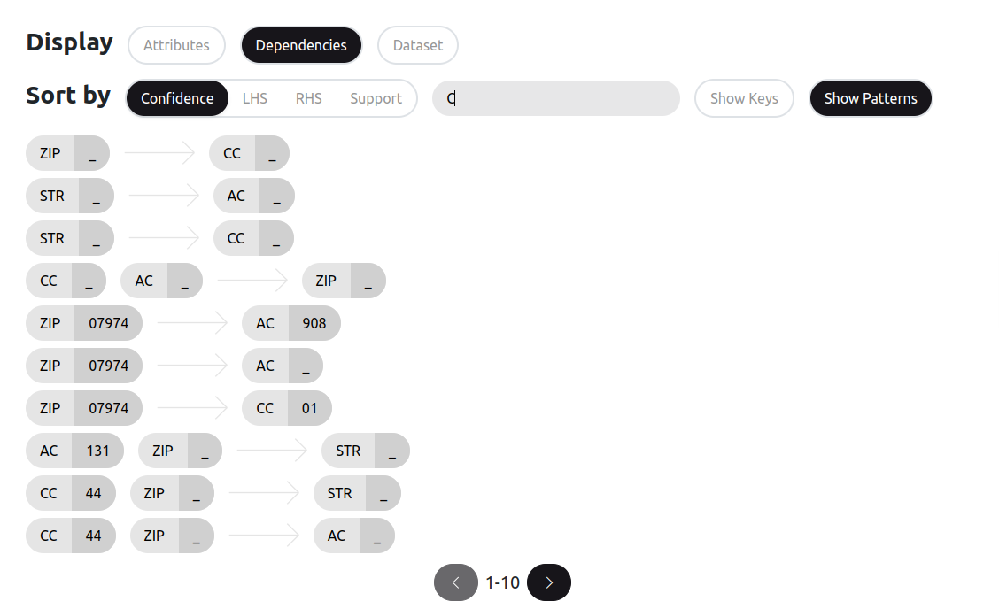
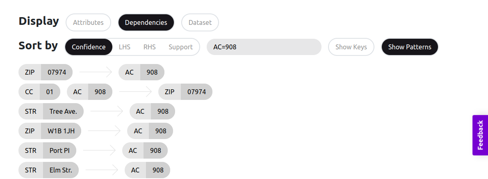
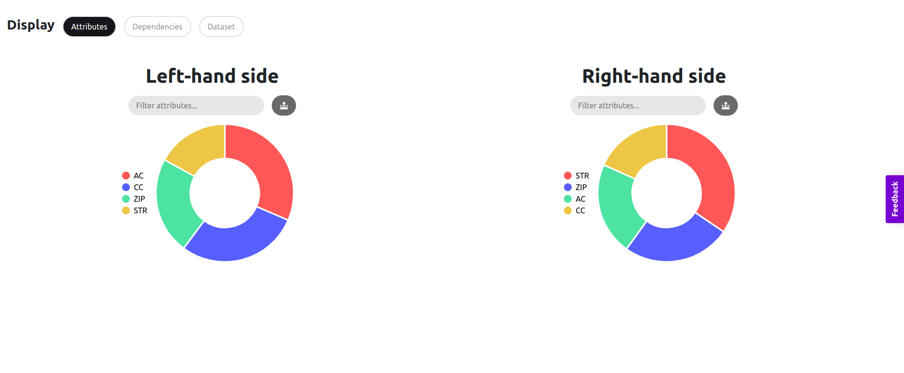
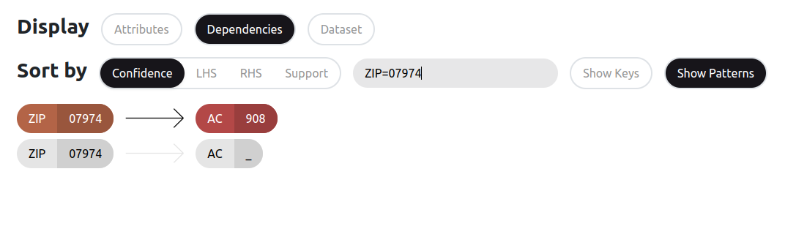
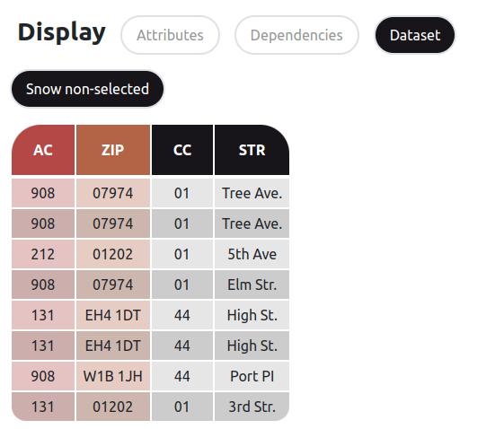

# Mining Conditional Functional Dependencies

Conditional Functional Dependencies (CFD) can be seen as an unification of Functional Dependencies (FD) and Association Rules (AR) since they allow to mix attributes and attribute/value pairs in dependencies. Unlike FDs, CFDs are allowed to hold only on a part of relation. The core idea of CFDs is to define a subset of a relation on which some FDs will hold.

CFD is defined as a pair consisting of FD and a pattern tuple. Consider the following CFD f = (CC, ZIP -> STR, (44, _ \|\| \_)). The '\_' symbol represents any possible value and the ‘\|\|’ symbol separates the left part of a pattern tuple from the right one. The CFD f can be considered as FD СС, ZIP -> STR, which is defined on all tuples of the relation where CC equals 44 (σ_{CC=44}(r), where r is the considered relation).

It is important to mention that selection is performed using the LHS of the pattern tuple. For example, confsdsider the following CFD f2= (CC -> STR, (01 \|\| “Tree ave.”)).
CFD f2 holds if:
1. FD=CC -> STR holds on σ_{CC=01}(r), and
2. STR is equal to “Tree ave.” for all tuples of σ_{CC=01}(r).

Let's look at a more illustrative example:

This table contains the "Employee" relation (denoted as ‘r’). Consider an FD that holds on r:
φ1: (Surname, Country, On vacation -> Company)

FD φ1 means that workers from the same country, with the same last name, who have the same leave status, work for the same company.

In fact, for r we can find several CFDs that refine φ1. Consider one of them:
φ’1: (Surname, Country,  On vacation -> Company, (Moore, USA, _ \|\| StuntSet))

This dependency is satisfied only on the part of the Employee relationship, namely: all workers with the last name Moore from the United States who have the same vacation status and who work for the company StuntSet.

φ2: (Surname -> On vacation, (Lee \|\| false))

The CFD φ2 does not refine the corresponding FD, since FD Surname -> On vacation does not hold. Indeed, the surname Moore violates the dependency for IDs 8 and 11. At the same time, it holds on a part of r. Thus, CFD φ2 says that employees with the same last name Lee are not on vacation.

Unlike the FD, the CFD can be violated by a single tuple. For example, consider the CFD
φ3: (ID -> Surname, (1 \|\| Lee)). Indeed, the tuple with ID = 1 violates the given CFD (the person with ID 1 has the surname Moore).

It is possible to employ mining algorithms that will discover CFDs holding on a given relation. Such algorithms output a list of minimal dependencies. Dependency is called minimal if it is non-trivial, left-reduced and holds on the given dataset.

Similarly to FD, for CFD there is an approximate version for this concept.

## Configuring the task

The first step is to upload a CSV table and specify the required parameters (delimiter and header row).

Next, it is necessary to select an algorithm and set its parameters. Currently, there are three parameters:

- _arity constraint_ is a threshold on LHS size of mined dependencies, e.g. if its value is 3, the algorithm will find a dependency such as AB->C, but will not proceed to checking ABCD->E. Users are more interested in discovering shorter dependencies since they have a larger chance of holding on the whole (including unseen) data. Thus, setting arity constraint allows to reduce the amount of output. This constraint also significantly reduces time it takes to discover dependencies.  

- _minimum support_ is needed to discard all dependencies which hold only on a small subset of relation. Support is a share of records which conform to the left part of the pattern tuple (for example, for CFD f2 it is a number of records which have CC = 01).

- _minimum confidence_ is used to search for approximate dependencies. Confidence is a ratio of the number rows on which the dependency is held to support.

## Running the task
Click “Analyze” to launch the task. This button immediately becomes available after selecting a dataset.

## Analyzing the results
You can check three tabs to analyze the results. The “Dependencies” tab allows a user to view a paginated list of all found dependencies.

It is possible to sort the list of dependencies according to the _confidence_ parameter, in ascending lexicographical order of attribute names in the left or right part, or by the _support_ parameter. The “Show Patterns” button allows to hide (show) values that are assigned to attributes participating in CFD. If your dataset contains single-column keys, the algorithm would yield a set of FDs A→X for every column X and key A. To keep or filter such dependencies out you can select whether to show keys or not.

The filter string offers several usage scenarios:

1. It is possible to obtain a list of dependencies that contain attributes with the specified name. For example if filter string contains “C”, then “AC”, “CC” and others will be displayed as shown below;
  

2. It is possible to obtain dependencies containing attributes with the specified value (in this case attribute name may be fully or partially specified). The filter string must be in the form of “Attribute=Pattern”. Pattern may either be a constant or a “_” symbol, which denotes a wildcard (any attribute value).
  

The Attributes tab is useful when it is necessary to select dependencies which must contain user-specified attributes. Unlike filtering string, with pie chart representation users can select multiple attributes and can indicate which have to be present in the left and right parts. The attribute area size on the diagram is higher for the attributes which appear in the greater number of dependencies.

In particular, suppose that we want to select dependencies which have “ZIP” attribute in the left part and “AC” in the right part. Below we set another constraint that specifies that we are interested in dependencies that have a particular value of ZIP.

After selecting a dependency it will be highlighted as shown above. Then, it is possible to switch to the Dataset tab which contains table snippets with highlighted columns participating in this dependency.

## Further Reading
For detailed explanation of the CFD concept see:

[1] Rammelaere, J., Geerts, F. (2019). Revisiting Conditional Functional Dependency Discovery: Splitting the “C” from the “FD”. In: Berlingerio, M., Bonchi, F., Gärtner, T., Hurley, N., Ifrim, G. (eds) Machine Learning and Knowledge Discovery in Databases. ECML PKDD 2018. Lecture Notes in Computer Science(), vol 11052. Springer, Cham. https://doi.org/10.1007/978-3-030-10928-8_33

[2] W. Fan, F. Geerts, L. V. S. Lakshmanan and M. Xiong, "Discovering Conditional Functional Dependencies," 2009 IEEE 25th International Conference on Data Engineering, 2009, pp. 1231-1234, doi: 10.1109/ICDE.2009.208.

## [Back to the main page](../index.md#task-dependent-analysis)
