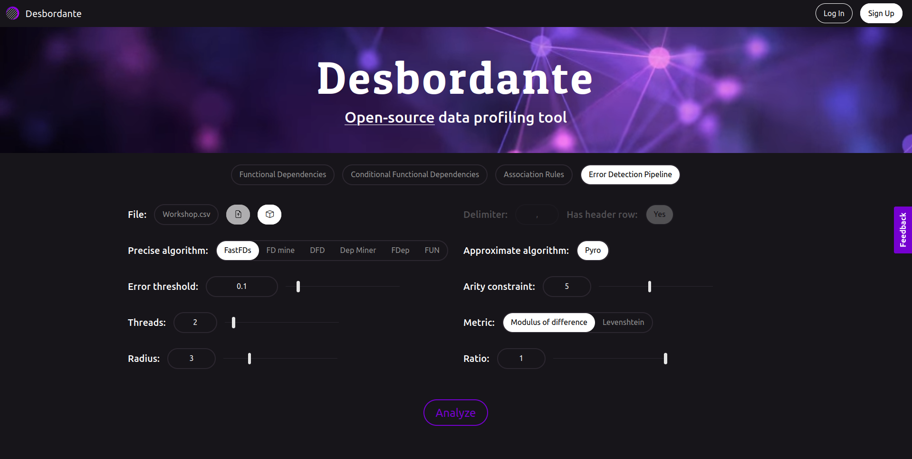
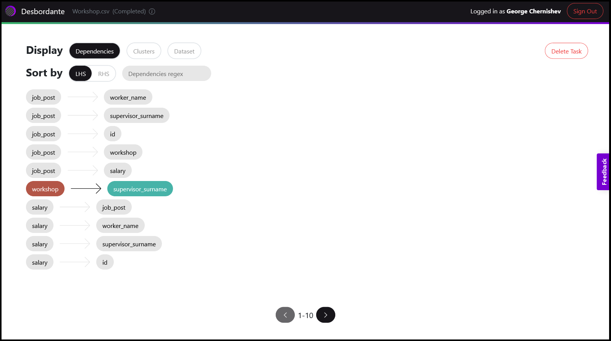
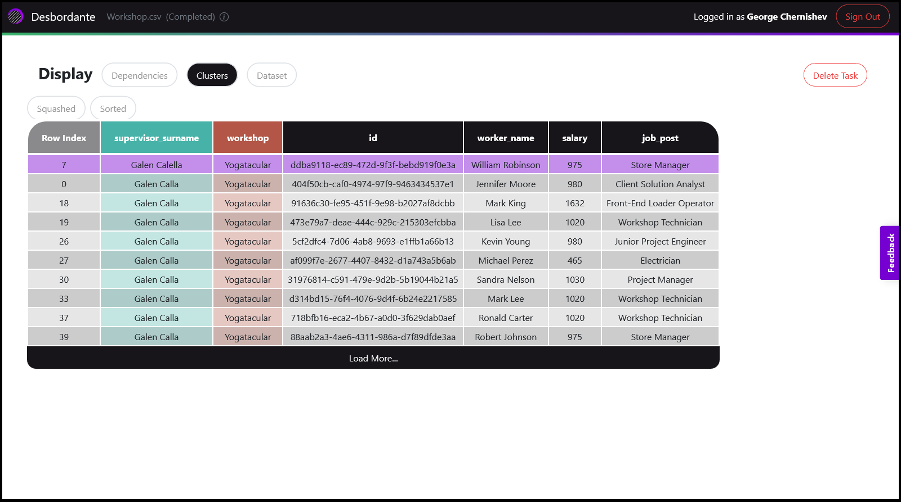
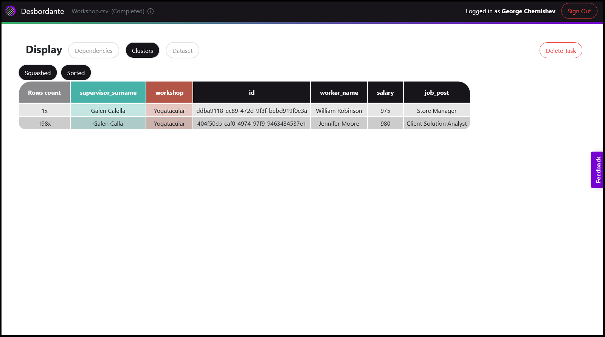

# Error Detection Pipeline

A pipeline is an algorithm that leverages several primitive mining algorithms in order to provide some functionality over data (not just discovering primitives). Error detection pipeline is the first (and the only for now) pipeline algorithm implemented. As its name states, it is capable of detecting errors in data, e.g. typos, measurement errors and so on. Its core idea is the following: usually, the number of the rows containing errors is much smaller than the number of correct rows. In order to find faulty rows, the pipeline uses FD and AFD mining algorithms, so if you are not familiar with FD and AFD primitives, read about them first.

In the first step the pipeline finds real AFDs holding over data, i.e. AFDs with a non-zero number of lines violating the exact FD. The “degree” of violation is specified by the _error threshold_ parameter, the same as for the AFD mining algorithms. Next, the user selects one of the found dependencies and the pipeline then outputs its clusters to the user for exploration. A cluster is the set of rows on which the exact FD is violated, i.e. the rows containing equal values in the LHS but different values in the RHS. If the data contains a row with errors, then it will be displayed in one of these clusters (if _error threshold_ was selected correctly).

However, in practice, there may be too many clusters if the specified  _error threshold_ is ill-fitting or if the data is too dirty. In such cases it may be hard to single out rows with errors. To address this issue and to provide more flexibility, there are two more parameters: _radius_ and _ratio_. For convenience, let’s call the value of any row in the RHS simply as the value. The _radius_ indicates the maximum difference between the value and the cluster center (the most common value in the cluster) to consider it to be an error.

Thus, if _radius_=1, and the value differs from the cluster center by 2, then the pipeline considers it to be irrelevant. Parameter  _ratio_ is needed to discard clusters with “many” distinct values. How “many” is specified by _ratio_, which belongs to the [0,1] interval. More formally, cluster ratio is the ratio of the number of deviating values to the size of the cluster. Deviating values are the ones that are not equal to the cluster center, but close to it (in terms of _radius_).

And if the cluster ratio is less than the specified _ratio_ then this cluster will be displayed to the user.

With these two parameters, it is possible to handle two different cases (but not only them):
* Local errors, a typo in one letter, or a small error in a number because some measuring device fails and, for example, outputs 4.00, 3.99, 4.00000001.
* Global outliers, which should be few, one, two or three per cluster, for example, the sequence “john”, “john”, “john smith”.

In the first case _radius_ parameter should be small (e.g. 1e-2 for numbers to consider values 4.00 and 3.99 as close) while the _ratio_ parameter can be relatively big (e.g. 0.2, which means that cluster will be outputted if it has less than 20% of values that are different from the center). Whereas in the second case _radius_ should be infinity (since we want to detect drastically different values) and _ratio_ may be small (if there are only a few outliers).  

## Usage example

After a dataset is uploaded and parameters are specified, the Analyze button becomes available.

Say that a number of real approximate functional dependencies was found, and they are displayed below. Next, the user selects one of interest. The dependency should be chosen based on the RHS, since errors will be looked for among the values of the RHS column. So, sorting by the RHS may come in handy. Let’s say that the user selects the workshop -> supervisor_name dependency by clicking on it.

Then go to the `Clusters` tab and look at the output.

There is one cluster with one highlighted faulty row. Only the first few rows of the cluster are displayed to save space. To display the entire cluster, the user can click the “Load More” button. By default the cluster is sorted by the uniqueness of the RHS value (i.e. the fewer times a value occurs, the earlier it is in the cluster). To return the initial order from the table the user should click the Sorted button. The Squashed button  “compresses” the rows, displaying the number of their occurrences:

Now we can see even more clearly that there is a typo in the “supervisor_name” column in the “Galen Calella” value.

## [Back to the main page](../index.md#task-dependent-analysis)
