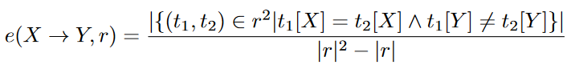
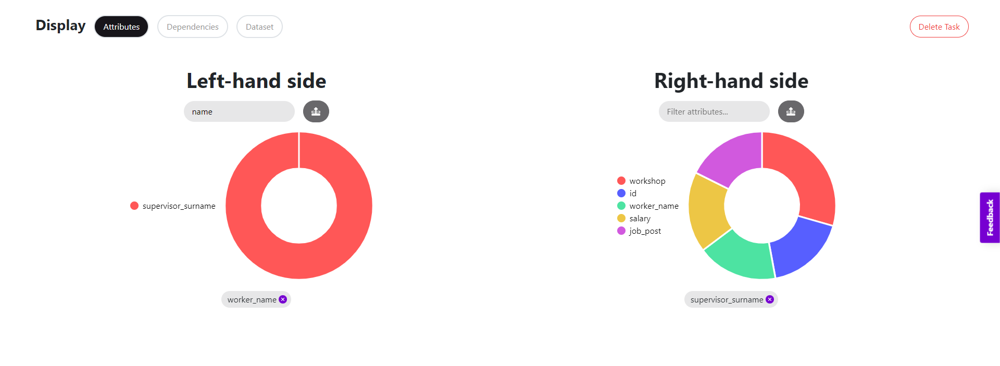
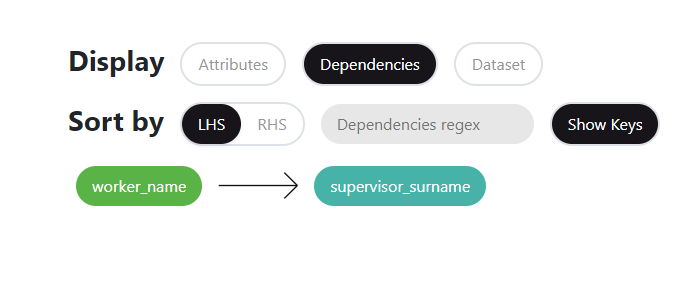
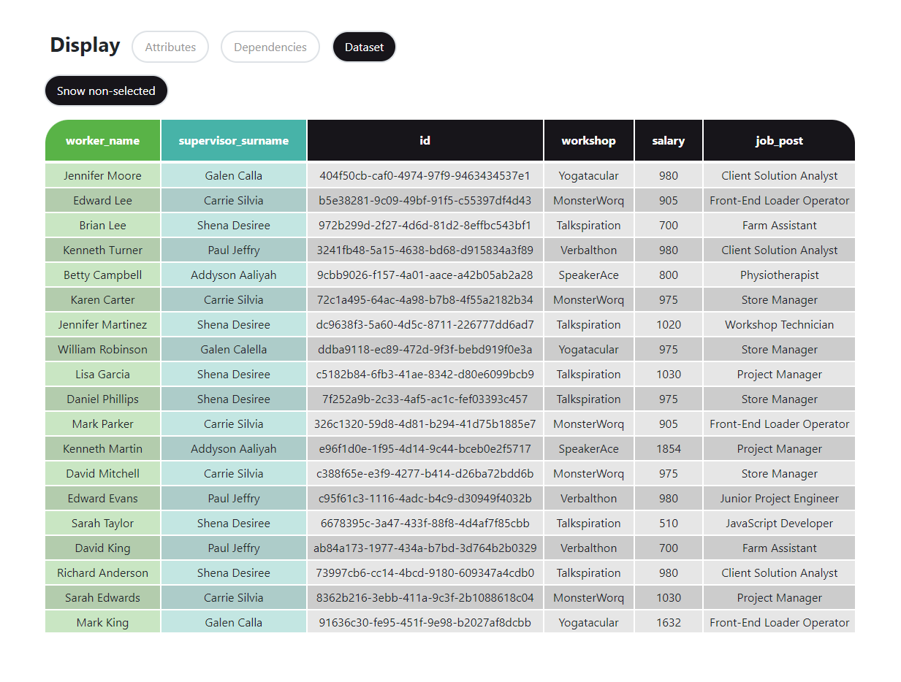

# Mining Exact and Approximate Functional Dependencies

A functional dependency (FD) is a constraint between two groups of attributes in a relation. A dependency FD: X → Y means that the values of Y are determined by the values of X. Two tuples sharing the same values of X will necessarily have the same values of Y.

Dependency discovery algorithms allow the user to obtain the FDs held in the data without any prior knowledge of the dataset. The algorithms have the same goal, namely, the discovery of all minimal non-trivial functional dependencies in a given dataset. Basically, it means that Desbordante will process your csv table and output a list of FDs excluding the self-evident ones like ABC→B and minimizing its size as much as possible, ensuring the full list is still deducible. It is worth noting that all the FDs will only have one attribute on the right since ABC→DE is equivalent to a pair of ABC→D and ABC→E.

Relevant data dependencies in real-world datasets are often not exact, so existing discovery algorithms fail to detect them. To cope with this problem, the definition of exact dependencies can be relaxed to allow for a certain degree of violation. Such relaxed dependencies are often called approximate dependencies (AFDs). An AFD A→B holds even if some rows violate the definition of FD, given that the fraction of such rows is small enough.

## Configuring the task

There are two major groups of parameters that can be modified.

The first one is dataset parameters — you have to manually specify the csv delimiter, as well as whether it has a header row or the file immediately starts with the data values.

The second one is algorithm parameters. Each algorithm may have up to three different parameters: arity constraint, error threshold, and threads.
- _arity constraint_ is a threshold on LHS size of mined dependencies, e.g. if its value is 3, the algorithm will find a dependency such as AB->C, but will not proceed to checking ABCD->E. “Shorter” dependencies are more valuable than “longer” ones, since they have a larger chance of holding on the whole (including unseen) data. Therefore, in the majority of cases the discovery of “short” dependencies is of priority . And setting the arity constraint reduces the volume of output. It also significantly reduces the time it takes to discover dependencies.
- _error threshold_ affects Approximate FD discovery. The greater it is, the higher the number of rows violating the dependency can be. If it is equal to zero, the algorithm will search only for strict functional dependencies. The error is computed as follows:
  
Basically, we calculate the ratio of all pairwise violations to the number of all pairs in the relation. The AFD X->Y is discovered if its error is less or equal to the threshold specified by the user.

- _threads is simply_ the number of threads that will be available to the algorithm. Choosing a greater thread number may significantly reduce the processing time, but the algorithm will take up more memory.

Some parameters may be disabled depending on the chosen algorithm. _Error threshold_ is available only to AFD algorithms, _threads_ is enabled only for parallelized algorithms, and _arity constraint_ is supported only by certain algorithms.

## Running the task

Click “Analyze” to launch the task. The execution will start right after the dataset is uploaded. The progress bar will help you track the algorithm progress, however, some algorithms do not report on their progress — the bar will appear motionless in this case.

## Analyzing the results

The plain list of FDs held on the dataset is usually too large to be useful on its own. You can use three tabs: _Attributes_, _Dependencies_, and _Dataset_ to filter, select and view the most prospective dependencies. The intended order of using these tabs goes as follows.

First, pick the attributes you are interested in using the _Attributes_ tab. The subsequent steps will use only those FDs which have at least one chosen attribute from the left diagram in their left-hand side and at least one from the right diagram in their right-hand side. The diagram can help you decide which attributes are the most interesting ones. The attribute area size on the diagram is higher for the attributes which appear in a greater number of dependencies, with shorter ones being given greater weight.

Click on an attribute to select it. If the number of attributes is too large, the least interesting ones will be hidden in the _other_ section. Click on it to expand it and view those attributes. You can return to the previous diagram state by pressing the button above the diagram. You can also filter the attributes by name on-the-fly.

Then, navigate to the _Dependencies_ tab to access the refined list of FDs. You can sort them lexicographically by LHS or RHS attribute names, and use a regex that goes through the list leaving only the matching FDs. If your dataset contains single-column keys, the algorithm would yield a set of FDs A→X for every column X and key A. To keep or filter such dependencies out, you can select whether to show keys or not. The list is paginated.

Finally, choose a dependency you are interested in and switch to the _Dataset_ tab. You can view the analyzed dataset, whose columns that belong to the selected FD are highlighted. Click the “Show non-selected” button to hide the other columns.

## Further Reading

For a detailed explanation of exact and approximate functional dependency concepts see:

[1] Thorsten Papenbrock, Jens Ehrlich, Jannik Marten, Tommy Neubert, Jan-Peer Rudolph, Martin Schönberg, Jakob Zwiener, and Felix Naumann. 2015. Functional dependency discovery: an experimental evaluation of seven algorithms. Proc. VLDB Endow. 8, 10 (June 2015), 1082—1093. https://doi.org/10.14778/2794367.2794377

[2] Sebastian Kruse and Felix Naumann. 2018. Efficient discovery of approximate dependencies. Proc. VLDB Endow. 11, 7 (March 2018), 759—772. https://doi.org/10.14778/3192965.3192968

## [Back to the main page](../index.md#task-dependent-analysis)
