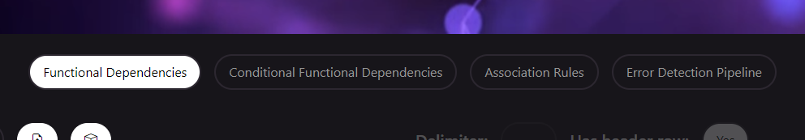
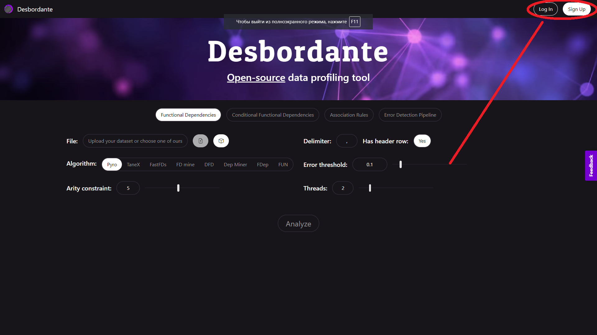
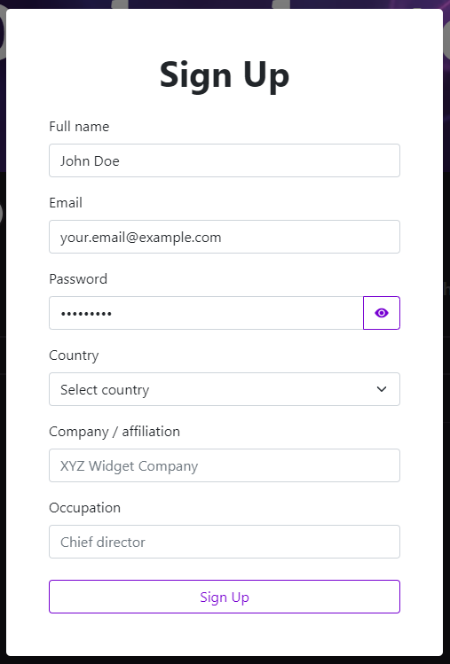
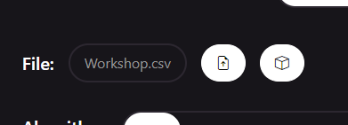
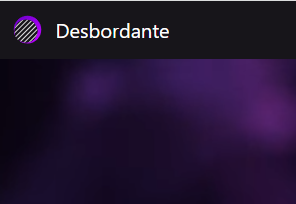
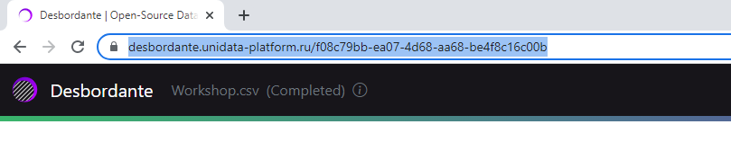
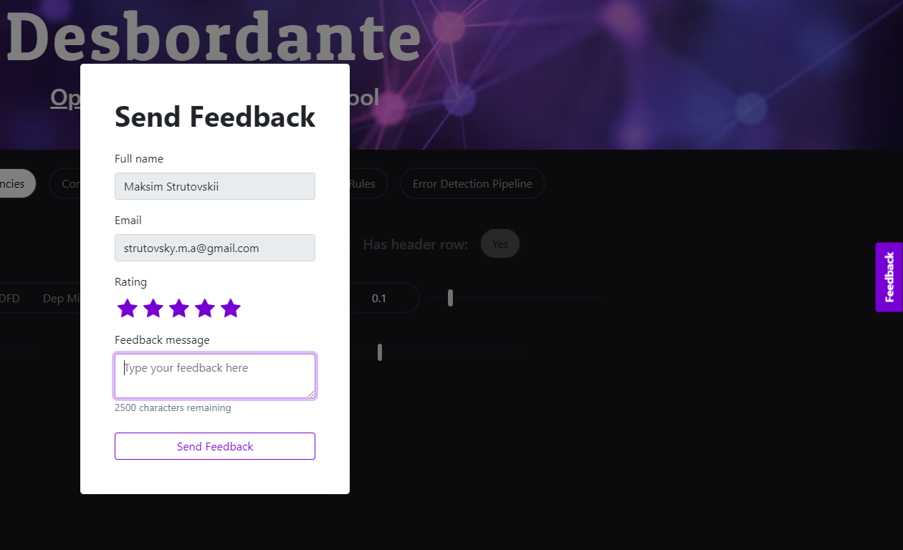

<p>

</p>

# About

Desbordante is a high-performance data profiler that is capable of discovering many different patterns in data using various algorithms. The currently supported data patterns are:
* Functional dependencies, both exact and approximate
* Conditional functional dependencies
* Association rules

It also allows to run data cleaning scenarios using these algorithms. At the moment, we have  implemented a typo detection scenario using an exact and approximate functional dependency discovery algorithm.

The algorithms of Desbordante are implemented in C++ to maximize the resulting performance. They can be run using either a console version or a web-application that features an easy-to-use web interface.

You can try the deployed version [here](https://desbordante.unidata-platform.ru/). You have to register in order to process your own datasets. Keep in mind that due to a large demand various time and memory limits are enforced (and a task is killed if it goes outside of acceptable ranges).

# How to use Desbordante

## General
Desbordante is a _data profiling_ tool. Its general usage scenario consists of five steps:
1. Choose a profiling task.
2. Choose the dataset.
3. Configure the task.
4. Run* the task.
5. Analyze the results.

\* Note that tasks are computationally expensive. Due to possible heavy workload, the deployed version has memory and run time limits for all users. If your task takes up more than 512MB RAM or 30 seconds of runtime, it will be killed. Contact us if you are interested in raising the limit.

The current section covers the first two steps, while the remaining ones are specific for each profiling task.


### Choosing the profiling task

Pick one of the existing tasks.

<p>

</p>


### Choosing the dataset


Desbordante provides a built-in collection of datasets to test its functionality. It is not possible for unauthorized users to upload their own data, so you will need to sign up to be able to do so.
After filling in the form you will only need to verify the provided email address.

<div class="row">
 <div style="float: left; width: 60%;" class="column">
 
 </div>
 <div style="float: left; width: 40%;" class="column">

 </div>
</div>

Choose an out-of-the-box dataset or upload your own. Currently, Desbordante accepts only .csv files.

<p>

</p>

### Task-dependent analysis

Check out the corresponding profiling task guide.
- [mining Functional Dependencies](guides/fd-mining.md);
- [mining Conditional Functional Dependencies](guides/cfd-mining.md);
- [mining Association Rules](guides/ar-mining.md);
- [employing the Error Detection Pipeline](guides/error-detection-pipeline.md).

## Additional information
* You can return to the main screen at any time by clicking the Desbordante logo or title.
<p>

</p>

* You can share the profiling results after the task execution finishes by copying the url with the task id.
<p>

</p>


* We would really appreciate reviews and opinions on our tool's usability and usefulness. We would be grateful if you provided your feedback using a dedicated form which can be accessed via the button on the right.
<p>

</p>


# Installation guide

## Ubuntu
The following instructions were tested on Ubuntu 18.04.4 LTS.
### Dependencies
Prior to cloning the repository and attempting to build the project, ensure that you have the following software:

- GNU g++ compiler, version 10+
- CMake, version 3.13+
- Boost library, version 1.72.0+

To use test datasets you will need:
- Git Large File Storage, version 3.0.2+

### Building the project
Firstly, navigate to a desired directory.
Then, clone the repository, cd into the project directory and launch the build script:
```
git clone https://github.com/Mstrutov/Desbordante/
cd Desbordante
./build.sh
```


### Getting the sample data

It is possible to fetch additional csv tables to try out Desbordante functionality right away.
It should happen automatically via Git LFS during repository cloning, but in case
it doesn't run the following script:
```
./pull_datasets.sh
```

### Launching the binaries
The script generates the following file structure in `/path/to/Desbordante/build/target`:
```bash
├───inputData
│   └───some-sample-csv\'s.csv
├───Desbordante_test
├───Desbordante_run
```
The `inputData` directory contains several .csv files that may be used by `Desbordante_test`. Run `Desbordante_test` to perform unit testing:
```
cd build/target
./Desbordante_test
```
The tool itself is launched via the following line:
```
./Desbordante_run --algo=tane --data=<dataset_name>.csv
```

The `<dataset_name>.csv`, which is a user-provided dataset, should be placed in the `/path/to/Desbordante/build/target` directory.

## Windows
---
**ATTENTION**

Currently Windows is not supported. The last compatible version has a tag `windows-compatible` &mdash;
later versions might compile, but the likelihood of such an event drastically declines with each commit.
You can use the following guide to checkout, build and run this particular version.

---
The following instructions were tested on Windows 10 .
### Dependencies
Prior to cloning the repository and attempting to build the project, ensure that you have the following software:

- Microsoft Visual Studio 2019
- CMake, version 3.13+
- Boost library, version 1.65.1+ \
  The recommended way to install Boost is by using [chocolatey](https://chocolatey.org/)

### Building the project
Firstly, launch the command prompt and navigate to a desired directory.
Then, clone the repository, cd into the project directory and launch the build script:
```
git clone https://github.com/Mstrutov/Desbordante/
cd Desbordante
git checkout windows-compatible
build.bat
```
*Note:* to compile the project, the script uses hard-coded path to MSVC developer command prompt, which is located
by default at `C:\Program Files (x86)\Microsoft Visual Studio\2019\Community\Common7\Tools\VsDevCmd.bat`.
You should change the path in the script if it differs from the default one.
### Launching the binaries
The script generates the following file structure in `\path\to\Desbordante\build\target`:
```bash
├───inputData
│   └───some-sample-csv\'s.csv
├───fdtester_test.exe
├───fdtester_run.exe
```
The `inputData` directory contains several .csv files that may be used by `fdtester_test`. Run `fdtester_test` to perform unit testing:
```
cd build\target
fdtester_test.exe
```
The tool itself is launched via the following line:
```
fdtester_run.exe --algo=tane --data=<dataset_name>.csv
```

The `<dataset_name>.csv`, which is a user-provided dataset, should be placed in the `\path\to\Desbordante\build\target` directory.

# Developers

Arthur Saliou       &mdash; Fdep implementation

Eduard Gaisin       &mdash; Dep-Miner implementation

Alexandr Smirnov    &mdash; DFD implementation

Ilya Shchuckin      &mdash; FD_Mine implementation

Michael Polyntsov   &mdash; FastFDs implementation

Ilya Vologin        &mdash; core classes

Maxim Strutovsky    &mdash; team lead, Pyro & TANE implementation

Nikita Bobrov       &mdash; product owner, consult, papers

Kirill Smirnov      &mdash; product owner, code quality, infrastructure, consult

George Chernishev   &mdash; product owner, consult, papers

# Cite

If you use this software for research, please cite the paper (https://fruct.org/publications/fruct29/files/Strut.pdf, https://ieeexplore.ieee.org/document/9435469) as follows:

M. Strutovskiy, N. Bobrov, K. Smirnov and G. Chernishev, "Desbordante: a Framework for Exploring Limits of Dependency Discovery Algorithms," 2021 29th Conference of Open Innovations Association (FRUCT), 2021, pp. 344-354, doi: 10.23919/FRUCT52173.2021.9435469.

# Contacts

[Email me at strutovsky.m.a@gmail.com](mailto:strutovsky.m.a@gmail.com)
